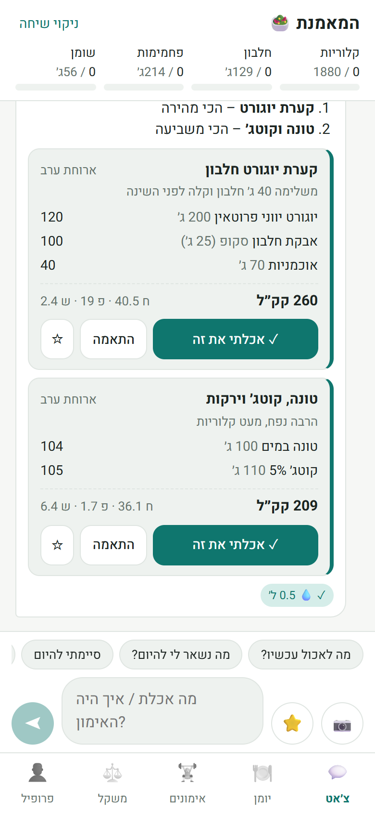
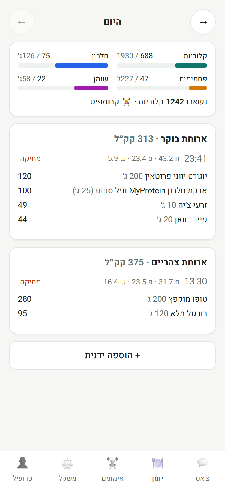
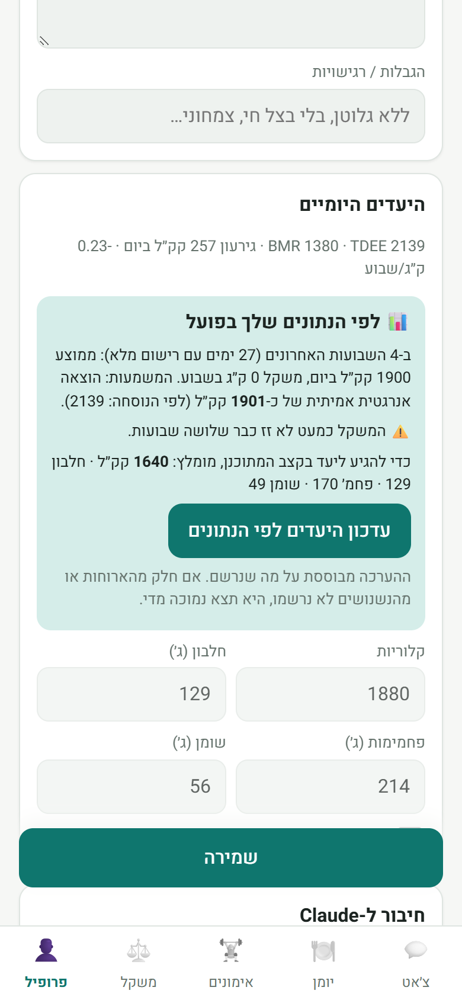

# המאמנת · Fit Coach

A Hebrew, chat-first mobile app for tracking diet and training every day, powered by Claude.
You tell the coach what you ate (or send a photo of your plate or a nutrition label), what workout you did, or what you weighed. Claude logs it, works out calories and macros, and keeps you on track toward your weight and fitness goals.

**Three ways to run it** (same app, same code):

| | Opens at | AI | Your data |
|---|---|---|---|
| **In claude.ai** *(recommended with a Claude Pro/Max plan)* | https://claude.ai/artifact/2Nd8HvkAwi7R9g3jxNQ3Gw | Your Claude subscription. No API key and no extra cost; usage counts toward your plan's limits. | Synced to your private space in the artifact's database, on every device you sign in on |
| **Standalone PWA + Gemini** *(free, installable app)* | https://alonaviram-arch.github.io/fit-coach/ | Google Gemini with a free Gemini API key | Only in that phone's browser (with JSON backup) |
| **Standalone PWA + Claude API** | same link | Claude with your own API key (pay per use) | Only in that phone's browser (with JSON backup) |

The standalone app lets you switch between Gemini and Claude any time in the profile screen.

The claude.ai link is private to its owner. To use it from another account, publish your own copy (see [docs/ARCHITECTURE.md](docs/ARCHITECTURE.md#publishing-the-claudeai-artifact)).

<p align="center">
  
  
  
</p>

## Features

| Area | What it does |
|---|---|
| **Chat coach (Hebrew)** | A dietitian and fitness-coach persona. It logs meals item by item (calories, protein, carbs, fat), shows running totals against your daily targets, suggests portions that fit what's left, and writes end-of-day and weekly summaries. It speaks to you in feminine or masculine Hebrew based on your profile. |
| **Meal suggestions** | Ask "מה לאכול עכשיו?" and the coach answers with 1–3 suggestion cards (items, grams, macros) that fit what's left of your day, your preferences and your training. Tap **✓ אכלתי את זה** to log a card, or **התאמה** first to change the portion (½–1½) or drop items. Suggestions are never logged unless you confirm. |
| **Favorite meals** | Save meals you eat often (from a card, from the daily log, or by asking in chat), then log them with one tap from the ⭐ button, or by name in chat ("הקערה הרגילה", "חצי מהקערה"). The coach offers to save a meal the third time you log it, and prefers your favorites when suggesting. |
| **Photos** | Photograph a meal, a restaurant plate or a nutrition label. Claude reads it and logs the values. |
| **Profile and goals** | Height, weight, age, sex, optional circumferences (waist, hips, chest, arm, thigh) and body-fat %. Goal type (lose, maintain or gain), target weight and date, fitness goals, food preferences and restrictions. |
| **Daily targets** | Worked out automatically (Mifflin-St Jeor BMR × activity, with a deficit or surplus sized to your goal date and kept within safe limits). You can override them manually, or agree on new ones with the coach in chat. |
| **Adaptive targets** | After about 3 weeks of logging and weigh-ins, the app estimates your *real* energy expenditure from what you ate and how your weight actually moved. If it differs from the formula, or your weight has stalled, it recommends new targets (one tap to apply). If the stall comes from eating above target, it says so instead of lowering the target. |
| **Water, steps, sleep** | Tap once per glass of water (goal ≈ 35 ml/kg), enter steps (goal set in profile) and last night's sleep, or just tell the coach. The coach takes them into account, e.g. after a short night it suggests a protein-rich breakfast. |
| **Daily log** | Meals grouped by type, macro progress bars, a day-by-day browser, delete, and manual add. |
| **Workouts** | Log type, duration, intensity, calories burned, and exercises (sets × reps × kg). Shows a weekly count against your training-days goal. The coach can also log workouts straight from chat. |
| **Weekly weigh-ins** | Weight plus optional measurements, a trend chart with a goal line, progress toward the goal, average weekly change, and a reminder when a weigh-in is due. |
| **Installable PWA** | Add it to your home screen on iPhone or Android. The app shell works offline. |
| **Private by design** | All data stays in your phone's browser. Nothing is stored on a server. You can export and import a JSON backup. |

## Claude connection

### With your Claude subscription (claude.ai)

Open the app from its claude.ai link. Inside claude.ai the app reaches Claude through the artifact runtime's `sample` capability, which runs on **the signed-in viewer's own Claude plan**. The first message asks you to allow it. After that:

- There's no API key and no separate bill. Usage counts toward your plan's normal limits, and heavy use can hit them.
- The model tier is set in the profile screen: רגיל (default), מתקדם (most capable), or מהיר (fastest).
- Photos work wherever the viewer supports sending images.
- Your log is saved in your private `data/users/<you>/` space. Nobody else can read it, including other people the artifact is shared with.

### With Gemini, free (standalone PWA)

1. Create a free key at [aistudio.google.com/apikey](https://aistudio.google.com/apikey) with a Google account.
2. In the app's profile screen, choose **Gemini · חינם**, paste the key, and save.
3. Models: **Gemini 3.8 Flash** (recommended) or **Gemini 3.5 Flash-Lite** (faster, larger free quota).

All the coach features work the same way: logging tools, suggestion cards, favorites and photos. Two things to know about the free tier: Google may use the content to improve its products, and there are per-minute and per-day request limits. When a limit is hit, the app shows a message asking you to try again later.

### With a Claude API key (standalone PWA)

Outside claude.ai, a claude.ai subscription can't be used by apps, so the PWA needs an API key:

1. Sign in at [console.anthropic.com](https://console.anthropic.com) with the same email you use for Claude.
2. Add credit under **Billing** (usage is pay-as-you-go and separate from a claude.ai subscription).
3. Create a key under **Settings → API keys** and paste it into the app's profile screen.

The key is stored only on your device and is sent only to `api.anthropic.com`.

**Models** (choose in the profile screen):

| Model | Best for | Price per 1M tokens (input / output) |
|---|---|---|
| Claude Opus 5 *(default)* | Most accurate nutrition estimates | $5 / $25 |
| Claude Sonnet 5 | A good balance of quality and cost | $2 / $10 |
| Claude Haiku 4.5 | Cheapest and fastest | $1 / $5 |

A typical day of logging is roughly 10–20 messages. The stable system prompt is cached to keep costs down.

## Install on your phone

**claude.ai version:** open the claude.ai link in your phone's browser while signed in to Claude, then add it to your home screen from the browser menu.

**Standalone PWA:**

1. Open the GitHub Pages link on your phone.
2. **iPhone (Safari):** tap Share → *Add to Home Screen*. **Android (Chrome):** tap ⋮ → *Install app*.
3. Fill in your profile, paste your API key, and start chatting.

Full Hebrew user guide: [docs/USER_GUIDE.he.md](docs/USER_GUIDE.he.md)

## Development

```bash
npm install
npm run dev      # http://localhost:5173/fit-coach/
npm run build    # type-check + production build to dist/
npm run lint
npm run build:artifact   # build + dist/artifact.html for publishing to claude.ai
```

Stack: React 19 + TypeScript + Vite, `@anthropic-ai/sdk` (browser mode), `zod` for validating tool input, and `marked` + `DOMPurify` for rendering Claude's markdown.

Every push to `main` deploys to GitHub Pages through [.github/workflows/deploy.yml](.github/workflows/deploy.yml).

## Documentation

- [docs/ARCHITECTURE.md](docs/ARCHITECTURE.md): data model, the Claude tool loop, prompt and caching design, and how targets are calculated
- [docs/REQUIREMENTS.md](docs/REQUIREMENTS.md): how the original Gemini dietitian conversation maps to app features
- [docs/USER_GUIDE.he.md](docs/USER_GUIDE.he.md): user guide (Hebrew)
- [CHANGELOG.md](CHANGELOG.md)

## Disclaimer

The coach is an AI assistant, not a doctor or registered dietitian. Nutrition values are estimates. For medical conditions, pregnancy or eating-disorder concerns, consult a professional.
